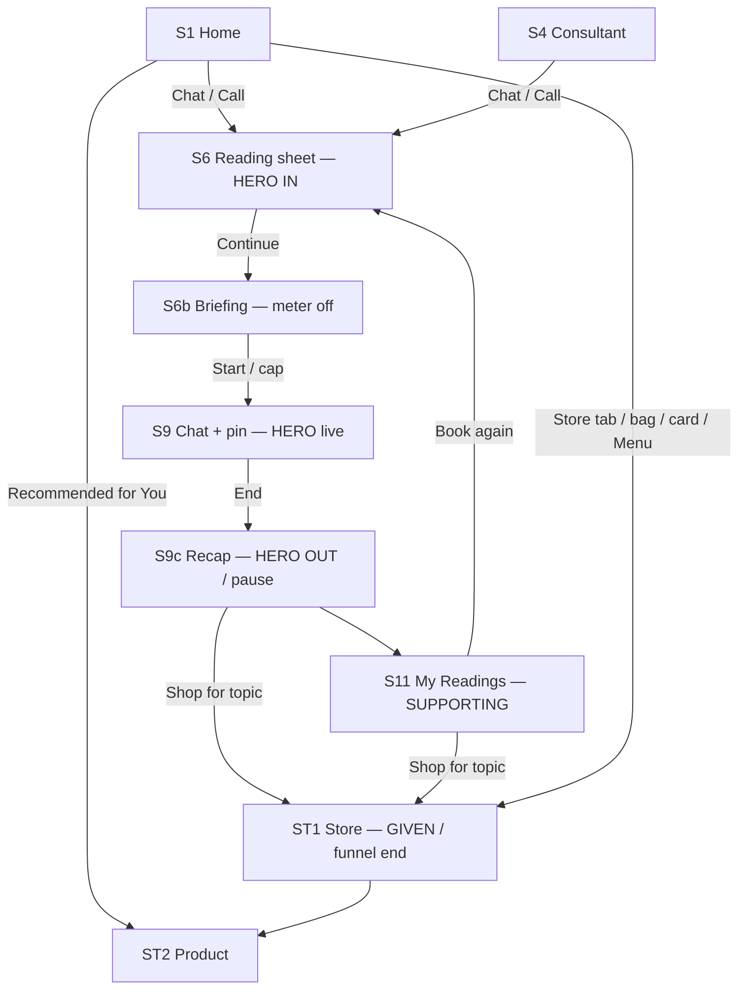

# AstroLive prototype — screen architecture (final)

**Product freeze:** [Suggested-Directions.md](./Suggested-Directions.md) — **1 hero + 1 supporting + Store (given).** This file is the screen map. It is not the pitch.

| Layer | Pitch name | Screens |
|-------|------------|---------|
| **Hero** | **The Reading** — consult together, walk out with a recap | `S6` `S6b` `S7`–`S8` `S9`/`S10` `S9c` |
| **Supporting** | **My Readings** + follow-up in days | `S11` `S12` `S13` |
| **Given** | **Astro Store** (end of funnel, not the open) | `ST1`–`ST5` |
| **Mechanism (internal only)** | `SessionFile` in `js/session.js` | Same objects. **Do not say “Session File” in the video.** |

**Constraint:** **App interface only** — live AstroLive **phone app**, not the website. Same five **bottom** tabs. **No sixth tab.** Store = header **Home | Store** + bag + Home card + Menu.  
**Form:** One-page **app mock** (SPA). Unstop URL. No real server.  
**Rules:** [backendlogic.md](./backendlogic.md)  
**Build:** [implementation.md](./implementation.md)  
**Flows:** [userflow-and-system-design.md](./userflow-and-system-design.md)  
**Live:** [https://dhananjay7777.github.io/Astrolive/](https://dhananjay7777.github.io/Astrolive/)

Reuse the existing store UI. **Do not lead the pitch on Store.** Recap → **Shop for {topic}** / For You is the funnel join.

### As shipped (current prototype)

| Area | Current behaviour |
|------|-------------------|
| Header | ASTROLIVE · Home \| Store · search · bag · **wallet** (not bell) |
| Topics on `S6` | Career, Love, Family, Health, Money, Spiritual, **Not sure** |
| Recap `S9c` | **Home** (not Back) · badge `Saved · ₹49` / `Free preview` · Shop for {topic} or **Shop remedies** |
| Store chips | Love, Career, Wealth, Peace & Wellness (Planetary / Protection **removed**) |
| Store banners | For You + Categories; **hidden** on Best Sellers |
| Intention chips | Filter **in place** on every Store tab; laptop **click-and-drag** to scroll |
| My Readings | `seedReadingsIfEmpty()` — three demo rows if `astrolive_readings` is empty |
| Persistence | `astrolive_readings`, `astrolive_cart` (not `astrolive_proto_v1`) |

Build: audit vs live app → shell **including Store** → **The Reading** (in then out) → My Readings. Stretch last.

---

## Repo layout (prototype)

```
/
  index.html                 # markup only (phone, tabs, screens)
  css/app.css                # all styles
  js/data.js                 # PRODUCTS, intentions, recap seeds
  js/store.js                # reserved (cart/PDP still in app.js)
  js/session.js              # Reading / SessionFile APIs (later phases)
  js/app.js                  # navigation, Home, Store, cart
  asset/
  docs/                      # briefs — not the demo
```

| Rule | Why |
|------|-----|
| **One** `index.html` | Keeps the live `SessionFile` in memory; back stack works |
| **Do not** inline all CSS/JS | Store is already large |
| **Do not** add `chat.html` / `store.html` | Reloads lose the reading + cart |
| No bundler | `data.js` → `store.js` → `session.js` → `app.js` |
| No backend | `localStorage`: `astrolive_readings`, `astrolive_cart` |

---

## Locked features → screens

| Feature | Role | Screens |
|---------|------|---------|
| **Who for? Me / Partner / Both** | **Hero IN** (demo opens here) | Extra on `S6` + `S7`/`S8` |
| **Briefing** (meter off) | **Hero chrome** | `S6b` |
| **Pinned card on chat** | **Hero live** | `S9`/`S10` |
| **Paid recap** | **Hero OUT / climax** | `S9c` |
| **My Readings + follow-up** | **Supporting** | `S11` `S12` `S13` |
| **Astro Store** | **Given — end of funnel** | `ST1`–`ST5`; entry from recap / readings **Shop this topic** |
| Second Opinion | Stretch | `S14` |

---

## 0. Shell

```
┌─────────────────────────────────────┐
│  ASTROLIVE   Home | Store    🔍 👜 💰 │
├─────────────────────────────────────┤
│  Active screen                      │
│  Home: consult first; Store card OK │
├─────────────────────────────────────┤
│  Home | Live | Hub | Consultant | Menu │
└─────────────────────────────────────┘
```

- Store is **not** a sixth **bottom** tab.  
- Hide bottom tabs on reading sheet, briefing, chat, recap, invite, PDP/cart/checkout if those are full-screen.  
- Header **Home** → consult Home (`S1`). Header **Store** / bag / Home card / Menu → `ST1`. Bag on Store → cart.

---

## 1. Screen inventory

| ID | Screen | Feature | Phase |
|----|--------|---------|------:|
| `S0` | App shell | — | 1 (after audit) |
| `S1` | Home (consult + recos) | Shell | 1 |
| `ST1` | Store home (For You / Categories / Best Sellers) | **Given / funnel end** | 1 |
| `ST2` | Product detail | Given | 1 |
| `ST3` | Cart | Given | 1 |
| `ST4` | Checkout | Given | 1 |
| `ST5` | Order confirmed | Given | 1 |
| `S2` | Live (stub) | Shell | 1 |
| `S3` | Astro Hub (stub) | Shell | 1 |
| `S4` | Consultant list | Shell | 2 |
| `S5` | Menu | Supporting + Store row | 1 / 6 |
| `S6` | Reading sheet: Who for? + topic (incl. **Not sure**) + note + recap opt-in | **Hero IN** | 3 / 4 |
| `S6b` | Briefing (meter off; chart(s) visible) | **Hero chrome** | 3 |
| `S7`–`S8` | Partner kundli pick / join invite | **Hero IN** | 4 |
| `S9`–`S10` | Chat + pinned reading (meter on) | **Hero live** | 5 |
| `S9c` | Recap card (scripted) + Home + Shop / Book again | **Hero OUT / climax** | 5 |
| `S11`–`S13` | My Readings + rebook + follow-up | **Supporting** | 6 |
| `S14` | Second Opinion | Stretch | 7 |

**Home `S1`:** consult first. **Recommended for You** = store recos from **last reading topic**. Not a shop-only home.

---

## 2. Shared data

`SessionFile` = internal name for **one Reading** ([backendlogic.md](./backendlogic.md)). Plus store:

```text
Product { id, name, intention, price, ... }
Cart { items: [{ productId, qty }] }
Order { id, items, total, createdAt }
RecapCard { topic, question, whoFor, bullets[], remedies[], paid }
```

Map `topic` → store `intention`: Career→career, Love→love, Family / Health / Spiritual / **Not sure**→peace, Money→wealth.

---

## 3. Flow (hero → shop last)



**Funnel:** Reading (who + topic) → recap → **Shop for {topic}** / For You. Purchase is optional. Do not force checkout to finish the hero.

---

## Phase 0 — Audit vs live app UI

Compare `index.html` to the **phone app**, not astrolive.app. Store in-app is **intentional**. Style Store as an **app** screen.

Tick-table: [implementation.md](./implementation.md) Phase 0.

---

## Phase 1 — Shell + Store (given)

Store clickable (`ST1`–`ST5`). Home consult-first. Live/Hub stubs. No sixth bottom tab. Home tab / Home mode returns to `S1`.

**Must not:** recorded demo that **opens** on the shop.

---

## Phase 2 — Consultant entry

`S4`; Home Chat/Call → `startConsult`. Sets `SessionFile.astrologerId`.

---

## Phase 3 — Hero chrome: sheet (Me) + briefing

`S6`: self kundli, topic, one-line question, **recap opt-in**, Continue. Who for? can default **Me**.  
`S6b`: briefing, meter **off**, card visible, “not charged yet,” Start / ~8–12s cap. Meter starts at Start.

---

## Phase 4 — Hero IN: Who for?

Same `S6`: **Me / Partner / Both**; saved kundli (Diya); optional `S8` join.  
**Stop if** this becomes a couples mini-app.  
**Demo open:** Love + **Both**. Five-second Me + Career later so it is not couples-only.

---

## Phase 5 — Hero live + OUT + funnel join

`S9`/`S10`: pin **whoFor** + charts + topic + question. Meter on. Scripted bubbles.  
End → `S9c` recap (who + 5 bullets + remedies + Home + Shop for {topic} + Book again). **Pause the demo here.**  
Shop for {topic} → `ST1` For You with `intention`. For You = last reading `storeIntention`.

---

## Phase 6 — Supporting: My Readings + days

Menu → list → detail. Recap on the row. Book again → `S6` prefilled (including Who for?). Follow-up 3d / 1w / 1m. Shop this topic → `ST1`.

---

## Phase 7 — Stretch: Second Opinion

After 1–6 only.

---

## Build order vs demo bar

| Phase | Feature | Show | Stop if… |
|------:|---------|------|----------|
| 0 | UI audit vs live app | Chrome matches | Looks like another brand |
| 1 | Shell + **Store in-app** | Shop works; consult Home first | 6th bottom tab; demo **opens** on shop |
| 2 | Consultant | Pick astrologer | Unlike live Consultant |
| 3 | Briefing + sheet (Me) | Meter off; not a blank loader | Meter on during review |
| 4 | **Hero IN** Who for? | Both / invite on *this* session | Couples mini-app / Hub match clone |
| 5 | **Hero OUT** recap + Shop this topic | Pause on recap; store is **last** | No recap; store is the open |
| 6 | Supporting My Readings | Rebook in **days**; recap on row | Clone of buffer / chat history |
| 7 | Stretch | Second opinion | Before the Reading |

**Minimum demo:** 0–5 (must include **Both** + recap; shop only as last tap).  
**Target:** + 6.  
**Pitch order:** Who for? **Both** → briefing (short) → chat → **recap pause** → My Readings → **Shop this topic**. Never say Session File.

---

## Routing

| Event | Next |
|-------|------|
| Header Home / Home tab | `S1` |
| Header Store / bag / Home card / Menu | `ST1` (bag on Store → cart) |
| Product | `ST2` → cart `ST3` → checkout `ST4`–`ST5` |
| Chat or Call | `S6` |
| Continue on `S6` | `S6b` (meter off) |
| Start / briefing cap | `S9` (meter on) |
| End session | `S9c` recap → save reading; For You intention = recap `storeIntention` |
| Shop for {topic} / Shop remedies | `ST1` For You + intention |
| Recap **Home** | `S1` (session already ended — do not pop back to chat) |
| Book again | `S6` prefilled |

---

## Never

Sixth bottom tab · Demo that **starts** on Store · Pitch that names **Session File** · Cloning **astrolive.app** · Real STT/LLM recap · Family inbox · Real pay/video · Multi-page HTML · Couples mini-app · Forced purchase to finish the hero

How to build, click-by-click: [implementation.md](./implementation.md).
