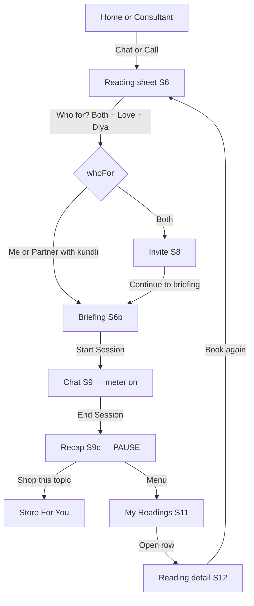

# User flow and system design

**Product:** AstroLive hackathon prototype — **The Reading** (hero) + **My Readings** (supporting) + **Astro Store** (given, end of funnel).

**Companion docs:** [Suggested-Directions.md](./Suggested-Directions.md) (product freeze) · [architecture.md](./architecture.md) (screen IDs) · [backendlogic.md](./backendlogic.md) (rules) · [implementation.md](./implementation.md) (build)

This file is the **end-to-end map**: who does what on which screen, and how the SPA is wired so that map holds without a server.

---

## 1. One-sentence system

A **single-page app** in a phone frame. Tapping Chat/Call creates one **Reading** in memory. The seeker fills Who for? + topic, the astrologer “reads” charts off the meter, chat ends in a **recap**, that recap lands in **My Readings**, and **Shop this topic** opens the in-app Store filtered by that topic.

No backend. Persistence is `localStorage`. Script load order: `data.js` → `store.js` → `session.js` → `app.js`.

---

## 2. Personas and roles

| Role | Who | What they do in the prototype |
|------|-----|-------------------------------|
| **Seeker** | Aarav (seed kundli) | Books Chat/Call, fills the sheet, chats, ends, shops, rebooks |
| **Partner** | Diya (saved kundli) | Not a second login. Attached as a snapshot on Who for? = Partner / Both, or via a scripted invite |
| **Astrologer** | Seeded list (Neelam, Chavvi, …) | Picked on Consultant / Home. Toggle **View as astrologer** during chat to see the same pinned card |
| **Shopper** | Same seeker | Browses For You / Categories / Best Sellers after (or without) a reading |

One browser. Partner and astrologer are **views and data**, not separate accounts.

---

## 3. User flows

### 3.1 Happy path — hero (demo)

This is the path to record. Store is **last**, not first.



**Click path (plain words)**

1. Home (or Consultant) → **Chat** on Neelam.
2. Reading sheet: **Both**, pick **Diya**, topic **Love**, one-line question, recap opt-in.
3. Invite screen (Both only) → Continue to briefing.
4. Briefing: progress bar, “not charged yet” → **Start Session**.
5. Chat: pinned card shows both names + topic. Scripted bubbles. Footer stays sticky.
6. **End Session** → recap (5 bullets + remedies). **Pause the demo here.**
7. Optional: **Shop this topic** → Store For You (Love banner + products).
8. Menu → **My Readings** → same recap → **Book again** (sheet prefilled).

**Variants on the same sheet**

| Who for? | Next screen | Charts on pin |
|----------|-------------|----------------|
| **Me** | Briefing (skip invite) | Aarav only |
| **Partner** | Briefing after picking Diya (or Add new Kundli) | Partner only |
| **Both** | Invite, then briefing | Aarav + Diya |

Call vs Chat only changes the channel label (`📞 Call` / `💬 Chat`). There is no live audio.

---

### 3.2 Supporting — My Readings

```text
Menu → My Readings (S11)
        │
        ├─ empty  → “No readings yet”  (only if localStorage was cleared
        │            and seeds were not written)
        └─ list   → tap row → Detail (S12)
                              ├─ Follow-up chips: 3 days / 1 week / 1 month
                              ├─ Shop this topic → Store For You
                              └─ Book again → S6 (same astrologer, topic, whoFor)
```

On first load, if `astrolive_readings` is empty, the app **seeds three demo readings** (Love Both, Career Me, Family Partner) so the shelf is never blank for a judge.

---

### 3.3 Given — Store (end of funnel)

```text
Entry points
  Header Home | Store
  Header bag (on Store → cart; else → Store)
  Home “Shop remedies” card / Recommended View All
  Menu → Astro Store / My Cart
  Recap / Detail → Shop this topic

ST1 Store home
  Tabs: For You | Categories | Best Sellers
  Shop by Intention chips (Love, Career, Wealth, …)
    For You / Best Sellers: chip filters in place (stay on that tab)
    Categories: chip selects that catalog + banner
  Banner: For You + Categories (intention image). Hidden on Best Sellers.

ST2 Product detail → Add to cart / Buy now
ST3 Cart → qty / remove → Checkout
ST4 Checkout (UPI / card / netbanking / COD — scripted)
ST5 Confirmation → Astro Journey → Retention (feedback)
```

Purchase is **optional**. Completing a reading does not require checkout.

---

### 3.4 Shell stubs (not the product)

| Control | Behaviour |
|---------|-----------|
| Bottom **Live** | Toast: coming later |
| Bottom **Astro Hub** | Toast: coming soon |
| Header **wallet** | Toast: ₹0 balance |
| Home tool tiles | Toast (Love Calculator, Horoscope, …) |

Five bottom tabs stay: Home · Live · Astro Hub · Consultant · Menu. Store is **not** a sixth tab.

---

### 3.5 Error / block paths

| Situation | What the user sees |
|-----------|-------------------|
| Continue with no topic | CTA disabled; hint “Select a topic” |
| Partner / Both with no kundli | CTA disabled; hint “Pick a partner kundli” |
| Add kundli with empty name or DOB | Toast; form stays open |
| Empty cart checkout | Empty state + Browse Store |
| Invalid pincode | Toast: enter 6 digits |
| End with no active session | Reset to Home |

---

## 4. System design

### 4.1 Shape

```
┌─────────────────────────────────────────────┐
│  index.html          views + chrome          │
│  css/app.css         all styles              │
│  js/data.js          PRODUCTS, ASTROLOGERS,  │
│                      RECAP_SEEDS, READING_SEEDS │
│  js/store.js         reserved (empty)        │
│  js/session.js       Reading APIs            │
│  js/app.js           router + store + render │
│  asset/              banners + product PNGs  │
└─────────────────────────────────────────────┘
         │
         ▼
   Browser only
   screenStack[]          in-memory navigation
   session.file           live Reading
   localStorage
     astrolive_readings   done recaps
     astrolive_cart       cart lines
```

**Why one HTML page:** a live `session.file` and a back stack must survive Home ↔ Store ↔ Chat. Separate `chat.html` / `store.html` would wipe both.

**Why no bundler:** judges open a public URL. Static host (GitHub Pages) serves the files as-is.

---

### 4.2 Navigation (router)

`js/app.js` keeps a **stack**, not a URL router.

| Function | Effect |
|----------|--------|
| `navigateTo(id)` | Push screen, `renderScreen()` |
| `goBack()` | Pop if stack length > 1 |
| `resetTo(stack)` | Replace stack (Home, Store, Book again, order confirm) |
| `currentScreen()` | Last item on the stack |

**Chrome rules**

- Home / Store / Menu / Consultant: header + bottom nav visible. Home \| Store pills only on Home and Store.
- Reading, briefing, invite, chat, recap, PDP, cart, checkout: header and bottom nav **hidden**; body is compact.
- Chat, astrologer view, reading detail: `display: flex` so the **footer CTAs stay sticky**.

---

### 4.3 Data model (what actually ships)

#### Reading (`SessionFile` in `session.file`)

Created by `startConsult(astrologerId, channel)`.

```text
id, astrologerId, astrologerName, channel
topic, note, whoFor
selfSnapshot { name, dob, tob, pob }
partnerSnapshot | null
recapOptIn, status
createdAt, startedAt, endedAt
recap { topic, question, whoFor, bullets[], remedies[], storeIntention, paid }
```

**Status (simplified vs spec):** `draft` → `ready` → `live` → `ended`. Briefing is a screen, not a persisted status in the current prototype.

#### Saved reading (My Readings row)

Same fields plus `selfName`, `partnerName`, `followUp { window, followUpAt, label }`. Written by `saveRecap()` into `astrolive_readings` (max 20).

#### Store

```text
Product { id, name, intention, price, oldPrice, rating, isBestSeller, … }
CartLine { id, qty }          // product id
Order { id, date, total, items, productName }   // in memory after Place Order
```

**Topic → store intention** (recap seeds)

| Reading topic | Store intention |
|---------------|-----------------|
| Career | career |
| Love | love |
| Family / Health / Spiritual | peace |
| Money | wealth |

---

### 4.4 Session status and APIs

```text
Chat/Call
   │ startConsult()
   ▼
 draft  ── selectWhoFor / selectTopic / pickPartner ──► still draft
   │ confirmReadingSheet()
   ▼
 ready  ── Both → invite ──► briefing
        ── Me / Partner ──► briefing
   │ startSession()
   ▼
 live   ── sendChatMessage / End
   │ endSession() → saveRecap()
   ▼
 ended  + row in astrolive_readings
   │ rebook()
   ▼
 new draft (new id; copy astrologer, topic, note, whoFor, snapshots)
```

| Function | File | Responsibility |
|----------|------|----------------|
| `startConsult` | session.js | New draft + navigate to sheet |
| `confirmReadingSheet` | session.js | Note + Both→invite else briefing |
| `startSession` | session.js | `live`, `startedAt`, chat |
| `endSession` / `saveRecap` | session.js | Recap from `RECAP_SEEDS[topic]`, persist |
| `listReadings` / `openReadingDetail` | session.js | Shelf |
| `rebook` | session.js | Prefill sheet; stack so Back returns to detail |
| `setFollowUp` | session.js | 3d / 1w / 1m chip on the saved row |
| `shopThisTopic` | session.js | `goToStoreTab('forYou', intention)` |
| `navigateTo` / `renderScreen` | app.js | Views |
| `addToCart` / `placeOrder` | app.js | Cart + fake checkout |

Chat copy is **scripted** (`RECAP_SEEDS[topic].chatBubbles`). There is no LLM, STT, or wallet debit.

---

### 4.5 Persistence

| Key | Contents | Survives refresh |
|-----|----------|------------------|
| `astrolive_readings` | Done readings + seeds | Yes |
| `astrolive_cart` | Cart lines | Yes |
| `session.file` | Active consult | **No** (in-memory only) |
| `state.lastOrder` | Last fake order | No |

`seedReadingsIfEmpty()` runs once on load: if readings array is `[]`, write `READING_SEEDS`.

---

### 4.6 Store subsystem

```text
selectStoreTab(tab)
selectIntention(id)     // stays on current tab; filters products
syncForYouIntention()   // last reading’s storeIntention, else career
getStoreProducts()
  forYou      → up to 2 products for selected intention (+ follow-up service card)
  bestSellers → bestsellers in that intention (fallback: all bestsellers)
  categories  → all products with that intention
```

Cart badge updates on header bag and Store bag. `placeOrder()` clears cart, builds `lastOrder`, `resetTo(['home','confirmation'])`.

---

### 4.7 Presentation vs logic

```text
index.html     Screen markup (ids: homeView, readingView, chatView, …)
css/app.css    Phone frame, purple chrome, sticky chat/detail footers
js/data.js     Seed catalogs (no I/O)
js/session.js  Reading lifecycle
js/app.js      DOM render + store + toast
```

`AVATAR_SVG` lives in `app.js`; `session.js` uses it at runtime (script order: session then app — chat bubbles run after both have loaded).

---

## 5. Screen ↔ flow map

| ID | Screen | Entered from | Leaves to |
|----|--------|--------------|-----------|
| S1 | Home | Launch, Home tab, logo | Consultant, Store, Chat/Call → S6 |
| S4 | Consultant | Bottom tab | Chat/Call → S6 |
| S6 | Reading sheet | startConsult, Book again | Invite or briefing |
| S8 | Invite | Both + Continue | Briefing |
| S6b | Briefing | Continue / invite | Chat |
| S9 | Chat | Start Session | Recap, astrologer view |
| S10 | Astrologer view | Toggle on chat | Back to chat |
| S9c | Recap | End Session | Store, Book again, Home |
| S11 | My Readings | Menu | Detail |
| S12 | Reading detail | List row | Store, Book again, list |
| ST1–ST5 | Store → confirm | Header, recap, menu | Cart / checkout / journey |

---

## 6. What is intentionally not in the system

| Out of scope | Why |
|--------------|-----|
| Real chat, video, ₹/min meter | Prototype; briefing copy only |
| Real invite SMS / two devices | Scripted “link copied” |
| Auth, wallet, payment gateway | Fake checkout |
| Second Opinion (S14) | Stretch; not built |
| Multi-page site / bundler | Would break the live session |
| Sixth bottom tab | Live app has five; Store is header |

---

## 7. Deploy implication

Because the system is static files + `localStorage`, **GitHub Pages** (or any static host) is enough. See [deploy.md](./deploy.md). The public URL is the Unstop submission artifact; it is not a clone of [astrolive.app](https://astrolive.app).
